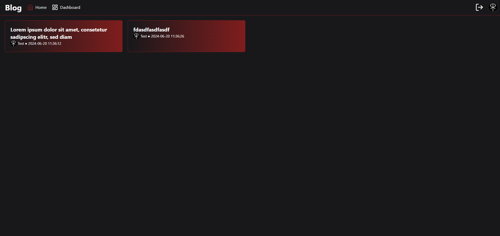
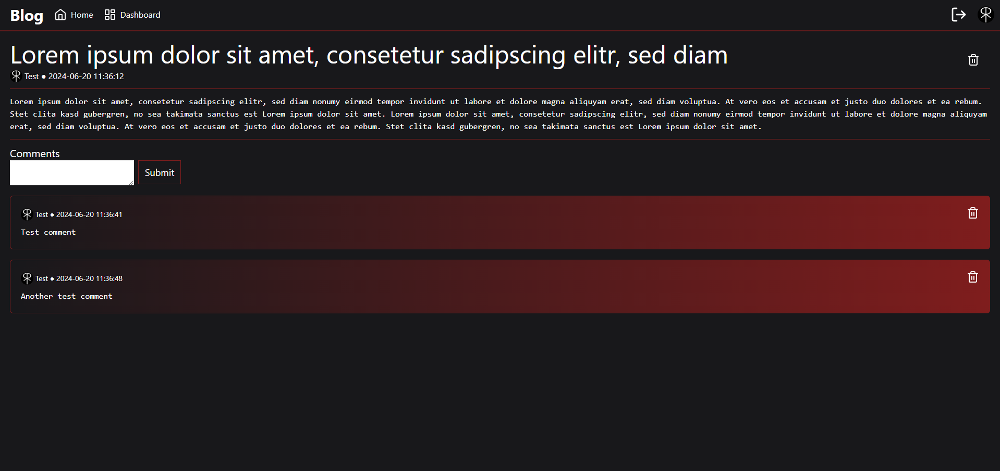

# Laravel Blog

## Development

### Install dependencies and migrate database

```bash
composer install
pnpm install
php artisan migrate
```

### Copy .env and fill APP_KEY

```bash
cp .env.example .env
php artisan key:generate
```

### Run development server

```bash
# In one terminal:
pnpm run dev

# In another terminal:
php artisan serve
```

The website is now running on [http://127.0.0.1:8000](http://127.0.0.1:8000).

## Screenshot

### Home



### Post

